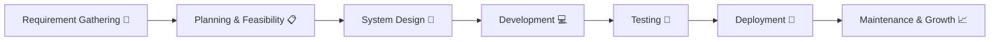
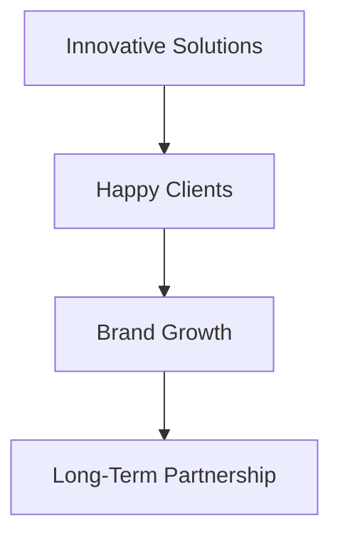
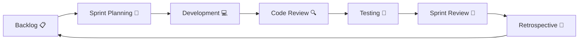
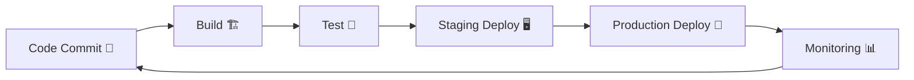
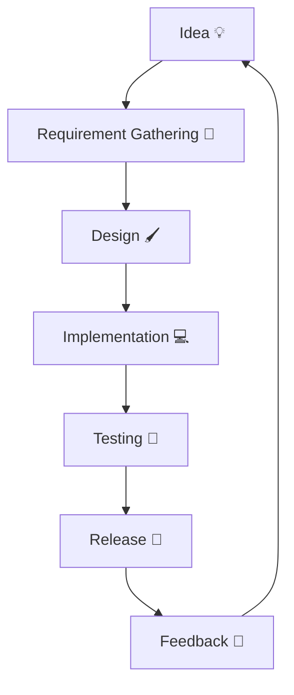
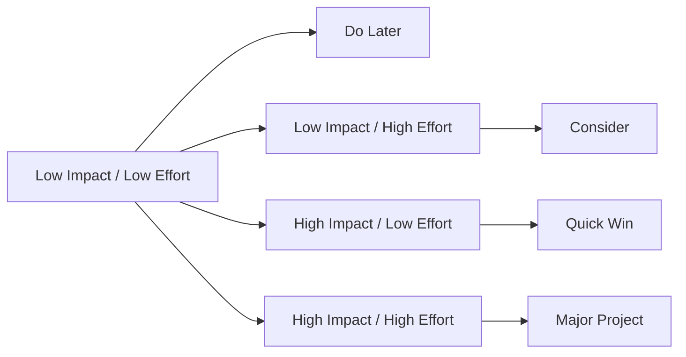
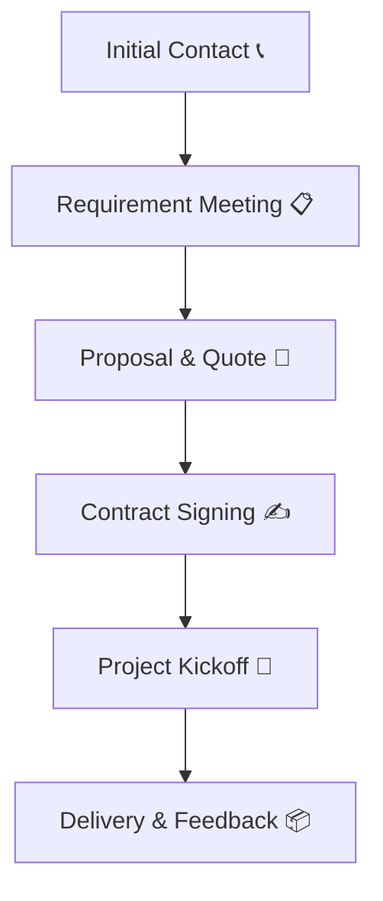

<!-- Oz Media Planet Profile README -->

<h1 align="center">🌍 Oz Media Planet</h1>
<h3 align="center">🚀 Building the Future of Digital Innovation</h3>

  
  
  
  
  

---

## 📝 About Us  

At **Oz Media Planet**, we deliver end-to-end digital solutions that help businesses scale and succeed.  
We combine **innovation, technology, and creativity** to craft powerful digital experiences.

---

## 🛠️ Tech Stack  

## 🛠️ Tech Stack  

  
  
  
  
  
  
  
  
  
  
  
  
  
  
  
  
  
  
  
  
  

## 💡 Core Services  

| Service | Description |
|---------|-------------|
| 📱 **Cross-Platform App Development** | High-performance apps for iOS, Android & Web. |
| 🌐 **Web Development** | Modern, scalable & responsive websites. |
| ☁️ **SaaS Development** | Robust software-as-a-service platforms built for scalability & security. |
| 🛠️ **Product Development** | From ideation to launch, we transform concepts into successful products. |
| 🗂️ **CRM Development** | Smart customer relationship management solutions. |
| 🔍 **SEO Optimization** | Data-driven SEO strategies to enhance visibility. |
| 📢 **Digital Marketing** | Creative campaigns that drive growth & brand recognition. |
| ☁️ **Cloud & Hosting Management** | Reliable, secure, and scalable infrastructure. |

---

## 📝 Our SDLC Lifecycle Model  
1️⃣ Software Development Process (Waterfall)

Client Idea → Requirement Analysis → Design → Development → Testing → Deployment → Maintenance

2️⃣ Agile Sprint Workflow

3️⃣ DevOps CI/CD Pipeline

4️⃣ Feature Development Lifecycle

5️⃣ Feature Prioritization Matrix

6️⃣ Client Onboarding Process

---

## 📊 Analytics & Service Visuals

### Service Distribution (Illustrative)
We track KPIs such as Monthly Active Users (MAU), Conversion Rate, Time-to-First-Byte, Error Rate, and Cost-per-Acquisition (CPA). Dashboards and reporting are provided via clients' chosen analytics platforms (Google Analytics, Mixpanel, Datadog).

*The illustrative pie chart shows a sample distribution of services — this helps clients prioritize budget and effort.*

---

### Typical Project Phase Duration (Illustrative)
This bar chart shows the typical average duration of project phases in days.

## 📌 Connect & Support  

  
  
  
  
  
  
  

---

🌟 **“Innovation, Technology & Creativity in Every Line of Code.”** 🌟

  ⭐ If you like our work, give us a star on GitHub! ⭐

© 2025 **Oz Media Planet**. All Rights Reserved.

