<!-- Oz Media Planet Profile README -->

<h1 align="center">🌍 Oz Media Planet</h1>
<h3 align="center">🚀 Building the Future of Digital Innovation</h3>

<p align="center">
  
  
  
  
  
</p>

---

## 📝 About Us  

At **Oz Media Planet**, we deliver end-to-end digital solutions that help businesses scale and succeed.  
We combine **innovation, technology, and creativity** to craft powerful digital experiences.

---

## 🛠️ Tech Stack  

<p align="center">
  
  
  
  
  
  
  
  
  
</p>

## 💡 Core Services  

| Service | Description |
|---------|-------------|
| 📱 **Cross-Platform App Development** | High-performance apps for iOS, Android & Web. |
| 🌐 **Web Development** | Modern, scalable & responsive websites. |
| ☁️ **SaaS Development** | Robust software-as-a-service platforms built for scalability & security. |
| 🛠️ **Product Development** | From ideation to launch, we transform concepts into successful products. |
| 🗂️ **CRM Development** | Smart customer relationship management solutions. |
| 🔍 **SEO Optimization** | Data-driven SEO strategies to enhance visibility. |
| 📢 **Digital Marketing** | Creative campaigns that drive growth & brand recognition. |
| ☁️ **Cloud & Hosting Management** | Reliable, secure, and scalable infrastructure. |

---


## 📝 Our SDLC Lifecycle Model  

```mermaid
flowchart LR
A[Requirement Gathering 📝] --> B[Planning & Feasibility 📋]
B --> C[System Design 🎨]
C --> D[Development 💻]
D --> E[Testing 🧪]
E --> F[Deployment 🚀]
F --> G[Maintenance & Growth 📈]
```

1️⃣ Software Development Process (Waterfall)

Client Idea → Requirement Analysis → Design → Development → Testing → Deployment → Maintenance


2️⃣ Agile Sprint Workflow

```mermaid
flowchart LR
    A[Backlog 📋] --> B[Sprint Planning 🏁]
    B --> C[Development 💻]
    C --> D[Code Review 🔍]
    D --> E[Testing 🧪]
    E --> F[Sprint Review 🎯]
    F --> G[Retrospective 🔄]
    G --> A

```

3️⃣ DevOps CI/CD Pipeline

```mermaid
flowchart LR
    A[Code Commit 💾] --> B[Build 🏗️]
    B --> C[Test 🧪]
    C --> D[Staging Deploy 🖥️]
    D --> E[Production Deploy 🚀]
    E --> F[Monitoring 📊]
    F --> A
```

4️⃣ Feature Development Lifecycle

```mermaid
flowchart TD
    A[Idea 💡] --> B[Requirement Gathering 📄]
    B --> C[Design 🖌️]
    C --> D[Implementation 💻]
    D --> E[Testing 🧪]
    E --> F[Release 🚀]
    F --> G[Feedback 🔄]
    G --> A
```

5️⃣ Feature Prioritization Matrix

6️⃣ Client Onboarding Process

```mermaid
flowchart TD
    A[Initial Contact 📞] --> B[Requirement Meeting 📋]
    B --> C[Proposal & Quote 💼]
    C --> D[Contract Signing ✍️]
    D --> E[Project Kickoff 🚀]
    E --> F[Delivery & Feedback 📦]

```


🤝 Connect With Us
<p align="center"> <a href="https://wa.me/91XXXXXXXXXX"></a> <a href="mailto:youremail@example.com"></a> <a href="tel:+91XXXXXXXXXX"></a> <a href="https://instagram.com/yourhandle"></a> <a href="https://linkedin.com/in/yourlink"></a> <a href="https://twitter.com/yourhandle"></a> <a href="https://facebook.com/yourpage"></a> </p>

📍 Address

🏢 Indore , M.P. , India 

🌟 Quote

“We don’t just build technology — we build experiences, strategies, and systems that create long-term value.”

<p align="center">⭐ Drop a star on our repos to support our work!</p> <p align="center">© 2025 Oz Media Planet. All Rights Reserved.</p> ```
