<!-- Oz Media Planet Profile README -->

<h1 align="center">🌍 Oz Media Planet</h1>
<h3 align="center">🚀 Building the Future of Digital Innovation</h3>

  
  
  
  
  

---

## 📝 About Us  

At **Oz Media Planet**, we deliver end-to-end digital solutions that help businesses scale and succeed.  
We combine **innovation, technology, and creativity** to craft powerful digital experiences.

---

## 🛠️ Tech Stack  

  
  
  
  
  
  
  
  
  

---

## 💡 Our Services  

### 📱 Cross-Platform App Development  
We build high-performance apps for iOS, Android, and Web using React Native, Flutter, and modern frameworks.

### 🌐 Web Development  
Modern, scalable, and responsive websites built with React, Node.js, Django, and Laravel.

### ☁️ SaaS Development  
Robust, secure, and scalable Software-as-a-Service platforms hosted on reliable cloud infrastructure.

### 🛠️ Product Development  
From ideation to launch, we transform your concepts into successful digital products.

### 🗂️ CRM Development  
Smart customer relationship management solutions to streamline operations and boost engagement.

### 🔍 SEO Optimization  
Data-driven SEO strategies to enhance visibility and improve organic reach.

### 📢 Digital Marketing  
Creative campaigns that drive growth, engagement, and brand recognition.

### ☁️ Cloud & Hosting Management  
Reliable, secure, and scalable infrastructure management on AWS, Azure, and GCP.

---

## 📝 Our SDLC Lifecycle Model  

```mermaid
flowchart LR
A[Requirement Gathering 📝] --> B[Planning & Feasibility 📋]
B --> C[System Design 🎨]
C --> D[Development 💻]
D --> E[Testing 🧪]
E --> F[Deployment 🚀]
F --> G[Maintenance & Growth 📈]
```

Client Idea → Requirement Analysis → Design → Development → Testing → Deployment → Maintenance

🤝 Connect With Us

        

📍 Address

🏢 Indore , M.P. , India 
